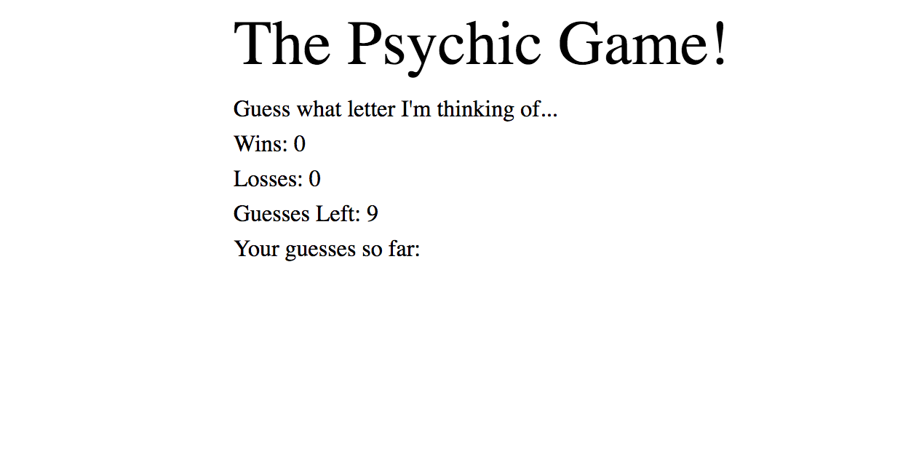

# Psychic-Game

Learning how to use javascript to create a game.

[Live Website](https://acekreations.github.io/Psychic-Game/)

## Technology Used
- HTML
- CSS
- javascript

## Learning Points
- Learned how to use onkeydone to trigger a series of game logic
- Learned how to use functions to make my code more usable
- Learned about arrays and how to use indexOf to determine if something exists in an array

## Author
Craig Melville
